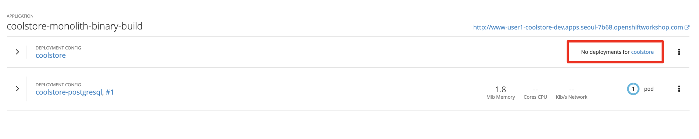

In this step we will migrate some Weblogic-specific code in the app to use standard Java EE interfaces.

####1. Open the file using CodeReady Workspaces

---

Follow these instructions to setup the development environment on CodeReady Workspaces. 

You might be familiar with the CodeReady Workspaces which is one of the most popular IDEs for Java and other
programming languages. [CodeReady Workspaces](https://access.redhat.com/documentation/en-us/red_hat_codeready_workspaces) is the next-generation Eclipse IDE 
which is web-based and gives you a full-featured IDE running in the cloud. You have an CodeReady Workspaces instance deployed on your OpenShift cluster
which you will use during these labs.

Go to the [CodeReady Workspaces URL]({{ ECLIPSE_CHE_URL }}) in order to configure your development workspace.

First, you need to register as a user. Register and choose the same username and password as 
your OpenShift credentials.


Log into CodeReady Workspaces with your user. You can now create your workspace based on a stack. A 
stack is a template of workspace configuration. For example, it includes the programming language and tools needed
in your workspace. Stacks make it possible to recreate identical workspaces with all the tools and needed configuration
on-demand. 

For this lab, click on the **Cloud Native Workshop v2** stack and then on the **Create** button. 


Click on **Open** to open the workspace and then on the **Start** button to start the workspace for use, if it hasn't started automatically.


You can click on the left arrow icon to switch to the wide view:


It takes a little while for the workspace to be ready. When it's ready, you will see a fully functional 
CodeReady Workspaces IDE running in your browser.


Now you can import the project skeletons into your workspace.

In the project explorer pane, click on the **Import Projects...** and enter the following:

> You can find **GIT URL** when you log in {{GIT_URL}} with your credential(i.e. user1 / openshift).

  * Version Control System: `GIT`
  * URL: `{{GIT_URL}}/userXX/cloud-native-workshop-v2m1-labs.git`
  * Check **Import recursively (for multi-module projects)**
  * Name: `cloud-native-workshop-v2m1-labs`


The projects are imported now into your workspace and is visible in the project explorer.

CodeReady Workspaces is a full featured IDE and provides language specific capabilities for various project types. In order to 
enable these capabilities, let's convert the imported project skeletons to a Maven projects. In the project explorer, right-click on **monolith** and then click on **Convert to Project**.


Choose **Maven** from the project configurations and then click on **Save**.


Repeat the above for inventory and catalog projects.

> **NOTE**: the **Terminal** window in CodeReady Workspaces. For the rest of these labs, anytime you need to run 
a command in a terminal, you can use the CodeReady Workspaces **Terminal** window. If you have **no response** from the Terminal when you're typing codes, 
**Close** the current Terminal and **Open a new Terminal again**.


####2. Review the issue related to `ApplicationLifecycleListener`

---

Open the Issues report at  RHAMT Web Console:


RHAMT provides helpful links to understand the issue deeper and offer guidance for the migration.

The WebLogic `ApplicationLifecycleListener` abstract class is used to perform functions or schedule jobs at Oracle WebLogic Server start and stop. In this case we have
code in the `postStart` and `preStop` methods which are executed after Weblogic starts up and before it shuts down, respectively.

In JBoss Enterprise Application Platform, there is no equivalent to intercept these events, but you can get equivalent functionality using a _Singleton EJB_ with standard annotations,
as suggested in the issue in the RHAMT report.

We will use the `@Startup` annotation to tell the container to initialize the singleton session
bean at application start. We will similarly use the `@PostConstruct` and `@PreDestroy` annotations to specify the
methods to invoke at the start and end of the application lifecyle achieving the same result but without
using proprietary interfaces.

While the code in our startup and shutdown is very simple, in the real world this code may require additional thought as part of the migration. However,
using this method makes the code much more portable.

####3. Open the file

---

Open the file `src/main/java/com/redhat/coolstore/utils/StartupListener.java` using this link.
The first issue we will tackle is the one reporting the use of _Weblogic ApplicationLifecyleEvent_ and
_Weblogic LifecycleListener_ in this file. Open the file to make these changes in the file.

~~~java
package com.redhat.coolstore.utils;

import javax.annotation.PostConstruct;
import javax.annotation.PreDestroy;
import javax.ejb.Startup;
import javax.inject.Singleton;
import javax.inject.Inject;
import java.util.logging.Logger;

@Singleton
@Startup
public class StartupListener {

    @Inject
    Logger log;

    @PostConstruct
    public void postStart() {
        log.info("AppListener(postStart)");
    }

    @PreDestroy
    public void preStop() {
        log.info("AppListener(preStop)");
    }

}
~~~

####4. Test the build

---

Go to `Commands Palette` and click on `build` in CodeReady Workspaces:


If builds successfully (you will see `BUILD SUCCESS`), then let's move on to the next issue! If it does not compile,
verify you made all the changes correctly and try the build again.


In the next step, we will migrate some Weblogic-specific code in the app to use standard Java EE interfaces.

Some of our application makes use of Weblogic-specific logging methods, which offer features related to logging of
internationalized content, and client-server logging.

In this case we are using Weblogic's `NonCatalogLogger` which is a simplified logging framework that doesn't use
localized message catalogs (hence the term _NonCatalog_).

The WebLogic `NonCatalogLogger` is not supported on JBoss EAP (or any other Java EE platform), and should be migrated to a supported logging framework, such as the JDK Logger or JBoss Logging.

We will use the standard Java Logging framework, a much more portable framework. The framework also
[supports internationalization](https://docs.oracle.com/javase/8/docs/technotes/guides/logging/overview.html#a1.17) if needed.

####5. Make the changes

---

Open the file to make these changes:

`src/main/java/com/redhat/coolstore/service/OrderServiceMDB.java`


~~~java
package com.redhat.coolstore.service;

import javax.ejb.ActivationConfigProperty;
import javax.ejb.MessageDriven;
import javax.inject.Inject;
import javax.jms.JMSException;
import javax.jms.Message;
import javax.jms.MessageListener;
import javax.jms.TextMessage;

import com.redhat.coolstore.model.Order;
import com.redhat.coolstore.utils.Transformers;

import java.util.logging.Logger;

@MessageDriven(name = "OrderServiceMDB", activationConfig = {
	@ActivationConfigProperty(propertyName = "destinationLookup", propertyValue = "topic/orders"),
	@ActivationConfigProperty(propertyName = "destinationType", propertyValue = "javax.jms.Topic"),
	@ActivationConfigProperty(propertyName = "acknowledgeMode", propertyValue = "Auto-acknowledge")})
public class OrderServiceMDB implements MessageListener {

	@Inject
	OrderService orderService;

	@Inject
	CatalogService catalogService;

	private Logger log = Logger.getLogger(OrderServiceMDB.class.getName());

	@Override
	public void onMessage(Message rcvMessage) {
		TextMessage msg = null;
		try {
				if (rcvMessage instanceof TextMessage) {
						msg = (TextMessage) rcvMessage;
						String orderStr = msg.getBody(String.class);
						log.info("Received order: " + orderStr);
						Order order = Transformers.jsonToOrder(orderStr);
						log.info("Order object is " + order);
						orderService.save(order);
						order.getItemList().forEach(orderItem -> {
							catalogService.updateInventoryItems(orderItem.getProductId(), orderItem.getQuantity());
						});
				}
		} catch (JMSException e) {
			throw new RuntimeException(e);
		}
	}

}
~~~

That one was pretty easy.

####6. Test the build

---

Build and package the app using Maven to make sure you code still compiles via CodeReady Workspaces **BUILD** window:


If builds successfully (you will see `BUILD SUCCESS`), then let's move on to the next issue! If it does not compile,
verify you made all the changes correctly and try the build again.

In this final step we will again migrate some Weblogic-specific code in the app to use standard Java EE interfaces,
and one JBoss-specific interface.

Our application uses [JMS](https://en.wikipedia.org/wiki/Java_Message_Service) to communicate. Each time an order is placed in the application, a JMS message is sent to
a JMS Topic, which is then consumed by listeners (subscribers) to that topic to process the order using [Message-driven beans](https://docs.oracle.com/javaee/6/tutorial/doc/gipko.html), a form
of Enterprise JavaBeans (EJBs) that allow Java EE applications to process messages asynchronously.

In this case, `InventoryNotificationMDB` is subscribed to and listening for messages from `ShoppingCartService`. When
an order comes through the `ShoppingCartService`, a message is placed on the JMS Topic. At that point, the `InventoryNotificationMDB`
receives a message and if the inventory service is below a pre-defined threshold, sends a message to the log indicating that
the supplier of the product needs to be notified.

Unfortunately this MDB was written a while ago and makes use of weblogic-proprietary interfaces to configure and operate the
MDB. RHAMT has flagged this and reported it using a number of issues.

JBoss EAP provides and even more efficient and declarative way
to configure and manage the lifecycle of MDBs. In this case, we can use annotations to provide the necessary initialization
and configuration logic and settings. We will use the
`@MessageDriven` and `@ActivationConfigProperty` annotations, along with the `MessageListener` interfaces to provide the
same functionality as from Weblogic.

Much of Weblogic's interfaces for EJB components like MDBs reside in Weblogic descriptor XML files. Open
``src/main/webapp/WEB-INF/weblogic-ejb-jar.xml`` to see one of these descriptors. There are many different configuration
possibilities for EJBs and MDBs in this file, but luckily our application only uses one of them, namely it configures
`<trans-timeout-seconds>` to 30, which means that if a given transaction within an MDB operation takes too
long to complete (over 30 seconds), then the transaction is rolled back and exceptions are thrown. This interface is
Weblogic-specific so we'll need to find an equivalent in JBoss.

> You should be aware that this type of migration is more involved than the previous steps, and in real world applications
it will rarely be as simple as changing one line at a time for a migration. Consult the [RHAMT documentation](https://access.redhat.com/documentation/en/red-hat-application-migration-toolkit) for more detail on Red Hat's
Application Migration strategies or contact your local Red Hat representative to learn more about how Red Hat can help you
on your migration path.

####7. Review the issues

---

From the RHAMT Issues report, we will fix the remaining issues:

* **Call of JNDI lookup** - Our apps use a weblogic-specific [JNDI](https://en.wikipedia.org/wiki/Java_Naming_and_Directory_Interface) lookup scheme.
* **Proprietary InitialContext initialization** - Weblogic has a very different lookup mechanism for InitialContext objects
* **WebLogic InitialContextFactory** - This is related to the above, essentially a Weblogic proprietary mechanism
* **WebLogic T3 JNDI binding** - The way EJBs communicate in Weblogic is over T2, a proprietary implementation of Weblogic.

All of the above interfaces have equivalents in JBoss, however they are greatly simplified and overkill for our application which uses
JBoss EAP's internal message queue implementation provided by [Apache ActiveMQ Artemis](https://activemq.apache.org/artemis/).

####8. Remove the weblogic EJB Descriptors

---

The first step is to remove the unneeded `weblogic-ejb-jar.xml` file. This file is proprietary to Weblogic and not recognized or processed by JBoss
EAP. Delete the file on Eclipse Navigator:


While we're at it, let's remove the `stub weblogic implementation classes` added as part of the scenario.
Delete the file on Eclipse Navigator:


####9. Fix the code

---

Open `src/main/java/com/redhat/coolstore/service/InventoryNotificationMDB.java`. Open the file to fix the code:

~~~java
package com.redhat.coolstore.service;

import com.redhat.coolstore.model.Order;
import com.redhat.coolstore.utils.Transformers;

import javax.ejb.ActivationConfigProperty;
import javax.ejb.MessageDriven;
import javax.inject.Inject;
import javax.jms.JMSException;
import javax.jms.Message;
import javax.jms.MessageListener;
import javax.jms.TextMessage;
import java.util.logging.Logger;

@MessageDriven(name = "InventoryNotificationMDB", activationConfig = {
        @ActivationConfigProperty(propertyName = "destinationLookup", propertyValue = "topic/orders"),
        @ActivationConfigProperty(propertyName = "destinationType", propertyValue = "javax.jms.Topic"),
        @ActivationConfigProperty(propertyName = "transactionTimeout", propertyValue = "30"),
        @ActivationConfigProperty(propertyName = "acknowledgeMode", propertyValue = "Auto-acknowledge")})
public class InventoryNotificationMDB implements MessageListener {

    private static final int LOW_THRESHOLD = 50;

    @Inject
    private CatalogService catalogService;

    @Inject
    private Logger log;

    public void onMessage(Message rcvMessage) {
        TextMessage msg;
        {
            try {
                if (rcvMessage instanceof TextMessage) {
                    msg = (TextMessage) rcvMessage;
                    String orderStr = msg.getBody(String.class);
                    Order order = Transformers.jsonToOrder(orderStr);
                    order.getItemList().forEach(orderItem -> {
                        int old_quantity = catalogService.getCatalogItemById(orderItem.getProductId()).getInventory().getQuantity();
                        int new_quantity = old_quantity - orderItem.getQuantity();
                        if (new_quantity < LOW_THRESHOLD) {
                            log.warning("Inventory for item " + orderItem.getProductId() + " is below threshold (" + LOW_THRESHOLD + "), contact supplier!");
                        }
                    });
                }


            } catch (JMSException jmse) {
                System.err.println("An exception occurred: " + jmse.getMessage());
            }
        }
    }
}
~~~

Remember the `<trans-timeout-seconds>` setting from the `weblogic-ejb-jar.xml` file? This is now set as an
`@ActivationConfigProperty` in the new code. There are pros and cons to using annotations vs. XML descriptors and care should be
taken to consider the needs of the application.

Your MDB should now be properly migrated to JBoss EAP.

####10. Test the build

---

Build and package the app using Maven to make sure you code still compiles via CodeReady Workspaces **BUILD** window:


If builds successfully (you will see `BUILD SUCCESS`), then let's move on to the next issue! If it does not compile,
verify you made all the changes correctly and try the build again.

####11. Run the RHAMT Web console against the project ( Instructor Only )

---

> **NOTE**: Considering network bandwidth of the workshop environment, `The only Instructor` use a backed WAR file in /opt/solution) to run this step.

In this step we will re-run the RHAMT report to verify our migration was successful.

Navigate to `Applications` on the left menu and click on `Add` the fixed application in /opt/solution to analyze the project.

You should delete the old application(i.e. monolith.war) to avoid to analyze it again and `Run Analysis` to analyze the project:


**Wait for it to complete before continuing!**. 

####12. View the results

---

Click on the lastet result to go to the report web page and verify that it now reports 0 Story Points:

You have successfully migrated
this app to JBoss EAP, congratulations!


Now that we've migrated the app, let's deploy it and test it out and start to explore some of the features that JBoss EAP
plus Red Hat OpenShift bring to the table.

####13. Add an OpenShift profile

---

Open the `pom.xml` file.

At the `<!-- TODO: Add OpenShift profile here -->` we are going to add a the following configuration to the pom.xml

~~~java
<profile>
  <id>openshift</id>
  <build>
      <plugins>
          <plugin>
              <artifactId>maven-war-plugin</artifactId>
              <version>2.6</version>
              <configuration>
                  <webResources>
                      <resource>
                          <directory>${basedir}/src/main/webapp/WEB-INF</directory>
                          <filtering>true</filtering>
                          <targetPath>WEB-INF</targetPath>
                      </resource>
                  </webResources>
                  <outputDirectory>deployments</outputDirectory>
                  <warName>ROOT</warName>
              </configuration>
          </plugin>
      </plugins>
  </build>
</profile>
~~~

####14. Create the OpenShift project

---

First, open a new brower with the `OpenShift Web Console`


Login using:

* Username: `userXX`
* Password: `openshift`

You will see the OpenShift landing page:


Click **Create Project**, fill in the fields, and click **Create**:

* Name: `userXX-coolstore-dev`
* Display Name: `USERXX Coolstore Monolith - Dev`
* Description: _leave this field empty_

> **NOTE**: YOU **MUST** USE `userXX-coolstore-dev` AS THE PROJECT NAME, as this name is referenced later
on and you will experience failures if you do not name it `userXX-coolstore-dev`!


Click on the name of the newly-created project:


This will take you to the project overview. There's nothing there yet, but that's about to change.

####15. Deploy the monolith

---

We'll use the CLI to deploy the components for our monolith. To deploy the monolith template using the CLI, execute the following commands via CodeReady Workspaces **Terminal** window:

Copy login command and Login OpenShift cluster:


Paste it on CodeReady Workspaces **Terminal** window.

Switch to the developer project you created earlier via CodeReady Workspaces **Terminal** window:

```execute
oc project userXX-coolstore-dev
```

And finally deploy template:

```execute
oc new-app coolstore-monolith-binary-build
```

This will deploy both a PostgreSQL database and JBoss EAP, but it will not start a build for our application.

Then open up the Monolith Overview page at `OpenShift Web Console`

and verify the monolith template items are created:



You can see the components being deployed on the
Project Overview, but notice the **No deployments for Coolstore**. You have not yet deployed
the container image built in previous steps, but you'll do that next.

####16. Deploy application using Binary build

---

In this development project we have selected to use a process called binary builds, which
means that instead of pointing to a public Git Repository and have the S2I (Source-to-Image) build process
download, build, and then create a container image for us we are going to build locally
and just upload the artifact (e.g. the `.war` file). The binary deployment will speed up
the build process significantly.

First, build the project once more using the `openshift` Maven profile, which will create a
suitable binary for use with OpenShift (this is not a container image yet, but just the `.war`
file). We will do this with the `oc` command line.

Build the project via CodeReady Workspaces **Terminal** window:

``mvn clean package -Popenshift``

> **NOTE**: Make sure to run this mvn command at working directory(i.e monolith).

Wait for the build to finish and the `BUILD SUCCESS` message!

And finally, start the build process that will take the `.war` file and combine it with JBoss
EAP and produce a Linux container image which will be automatically deployed into the project,
thanks to the *DeploymentConfig* object created from the template:

``oc start-build coolstore --from-file=deployments/ROOT.war``

Check the OpenShift web console and you'll see the application being built:


Wait for the build and deploy to complete:

``oc rollout status -w dc/coolstore``

This command will be used often to wait for deployments to complete. Be sure it returns success when you use it!
You should eventually see `replication controller "coolstore-1" successfully rolled out`.

> If the above command reports `Error from server (ServerTimeout)` then simply re-run the command until it reports success!


When it's done you should see the application deployed successfully with blue circles for the
database and the monolith:


Test the application by clicking on the Route link at `OpenShift Web Console`:


#####Congratulations!
Now you are using the same application that we built locally on OpenShift. That wasn't too hard right?


In the next step you'll explore more of the developer features of OpenShift in preparation for moving the
monolith to a microservices architecture later on. Let's go!

#### Summary

---

Now that you have migrating an existing Java EE app to the cloud 
with JBoss and OpenShift, you are ready to start modernizing the
application by breaking the monolith into smaller microservices in
incremental steps, and employing modern techniques to ensure the
application runs well in a distributed and containerized environment.

But first, you'll need to dive a bit deeper into OpenShift and how
it supports the end-to-end developer workflow.
